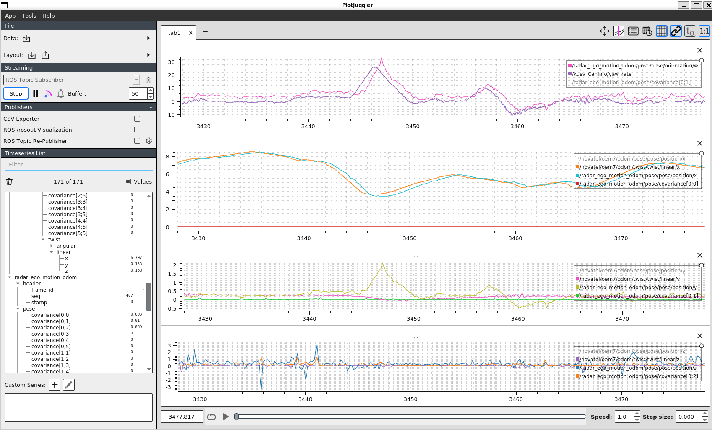

# Modified version of REVE - Radar Ego Velocity Estimator

This package takes radar point cloud as input and estimates the motion of the ego vehicle. This code is derived from 'reve' below and is built using catkin_make to directly estimate ego motion. It also includes the feature to tune various parameters in radar_ego_motion_estimation.ini. 

The published nav_msgs::Odometry in this code can be visualized using tools like PlotJuggler to verify the proper functioning of the current algorithm!



### Compile
```bash
git clone https://github.com/soyeongkim/radar_ego_motion_estimator.git
cd radar_ego_motion_estimator
catkin_make
```

### Run
```bash
source devel/setup.bash
roslaunch radar_ego_motion_estimation radar_ego_motion_estimation.launch
```

# REVE - Radar Ego Velocity Estimator

REVE - Radar Ego Velocity Estimator is an efficient C++ implementation for ego velocity estimation using radar scans. Such scans (=3D point cloud) can be
measured using modern mmWave radar sensors. Allows for robust and accurate ego velocity estimation even in challenging conditions (darkness, fog, smoke) as radar is not
affected by such conditions!

### Highlights

- Robust and accurate 3D radar ego velocity estimation
- Estimation in the radar frame or a body frame defined by an IMU
- Supports the [rio](https://github.com/christopherdoer/rio) and the ti_mmwave_rospkg point cloud format
- Radar trigger signals can be used for better synchronization
- Super fast: <0.25ms processing time per radar scan

The 3D radar ego velocity is estimated with a 3-Point RANSAC Least Squares approach. It requires a single radar scan (=3D point cloud) only making use of the
direction and Doppler velocity of each detected object. Thus, no scan matching is required resulting in robust velocity estimation even with high dynamics or
difficult scenes with many reflections. In addition, the variances of the resulting 3D ego velocity are estimated as well enabling subsequent fusion. This
approach was evaluated in indoor and outdoor environments for low and high dynamic motion achieving very accurate motion estimation as shown in the demo result.
This package provides also a node which estimates the body frame velocity defined by an IMU using the measured angular velocity and extrinsic calibration (body
frame to radar frame transform).

## Cite

If you use REVE for your academic research, please cite our related [paper](https://christopherdoer.github.io/publication/2020_09_MFI2020):

~~~[bibtex]
@INPROCEEDINGS{DoerMFI2020, 
  author={Doer, Christopher and Trommer, Gert F.},
  booktitle={2020 IEEE International Conference on Multisensor Fusion and Integration for Intelligent Systems (MFI)}, 
  title={An EKF Based Approach to Radar Inertial Odometry}, 
  year={2020},
  pages={152-159},
  doi={10.1109/MFI49285.2020.9235254}}
~~~

## License
The source code is released under the [GPLv3](http://www.gnu.org/licenses/) license.
